<div align="center">

<a href="https://ai.aeroscan.co.za/download">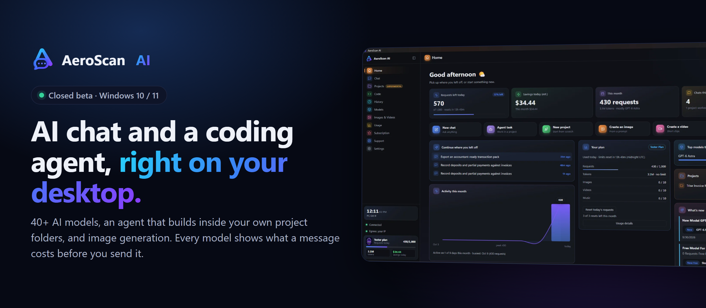</a>

<a href="https://github.com/adminaeroscan/aeroscan-beta/releases/download/v1.0.0-beta.2/AeroScan.AI-Beta-Setup-1.0.0-beta.2-x64.exe">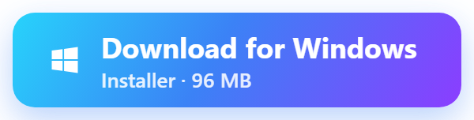</a>
<a href="https://github.com/adminaeroscan/aeroscan-beta/releases/download/v1.0.0-beta.2/AeroScan.AI-Beta-Portable-1.0.0-beta.2-x64.exe">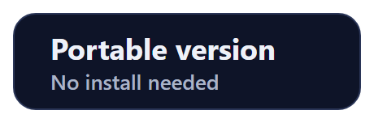</a>
<a href="https://ai.aeroscan.co.za/download">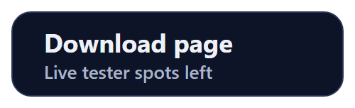</a>

<sub>Version 1.0.0-beta.2 · Windows 10 / 11, 64-bit · Free during the beta · <a href="https://github.com/adminaeroscan/aeroscan-beta/releases/latest">All releases</a></sub>

</div>

<br>

### GET STARTED
## Up and running in two minutes

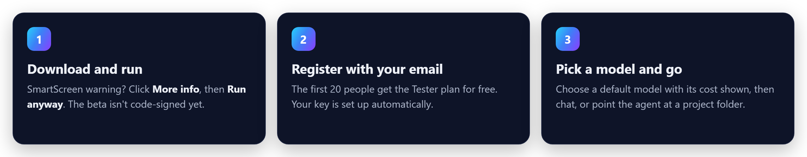

<br>

### WHAT YOU GET
## Everything in one window

No browser tabs, no copy-pasting code. Work happens on your own machine, in your own folders.

#### Agent mode: an agent that works in your project

Give it a task and it plans, edits files, runs your tests and reports back.

- ✅ Reads, writes and builds in a folder you choose
- ✅ Review, undo or commit every change it makes
- ✅ Stops when the checks pass, so it doesn't waste requests

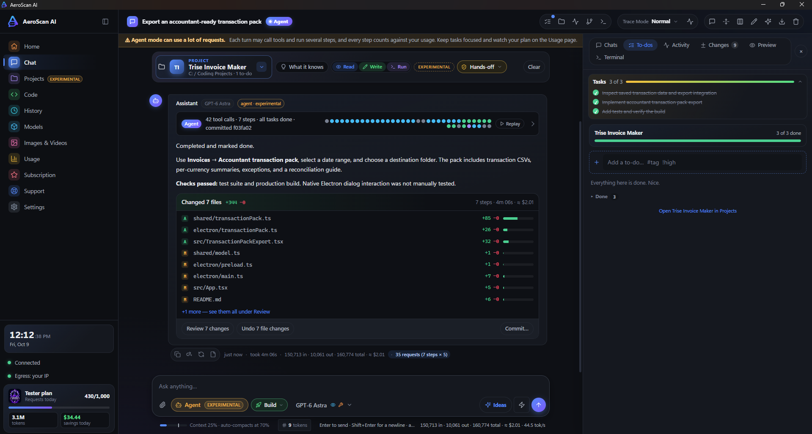

#### Projects: keep each project together

To-dos, milestones, notes, links, chats and agent runs live in one place for each folder. Start an agent chat straight from a to-do.

- ✅ To-dos and milestones with progress
- ✅ Feature ideas for your project, one click to build
- ✅ Git status and an AI summary of the project

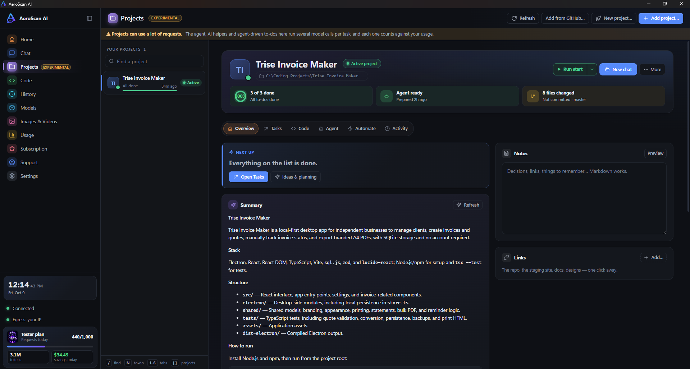

#### A closer look

<table>
<tr>
<td width="33%" valign="top"><a href="docs/chat.png">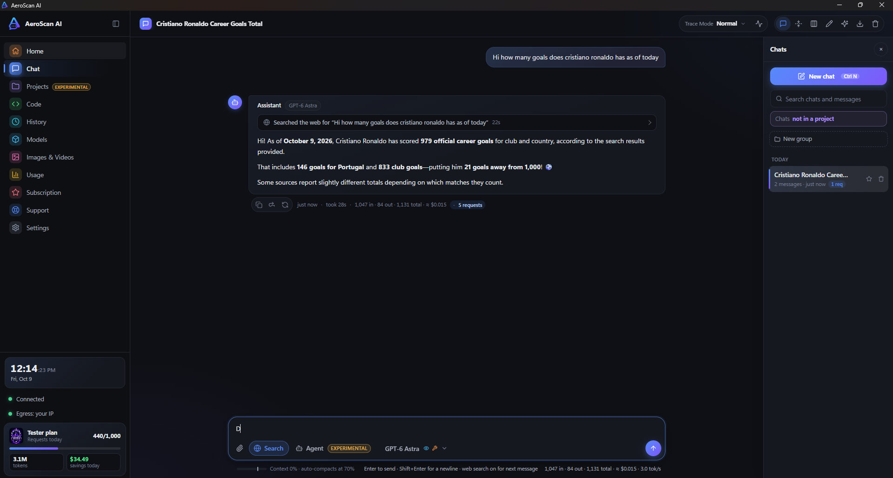</a><br><b>Chat with live web search</b><br><sub>Ask about today and it looks it up, with the cost of every reply shown.</sub></td>
<td width="33%" valign="top"><a href="docs/models.png">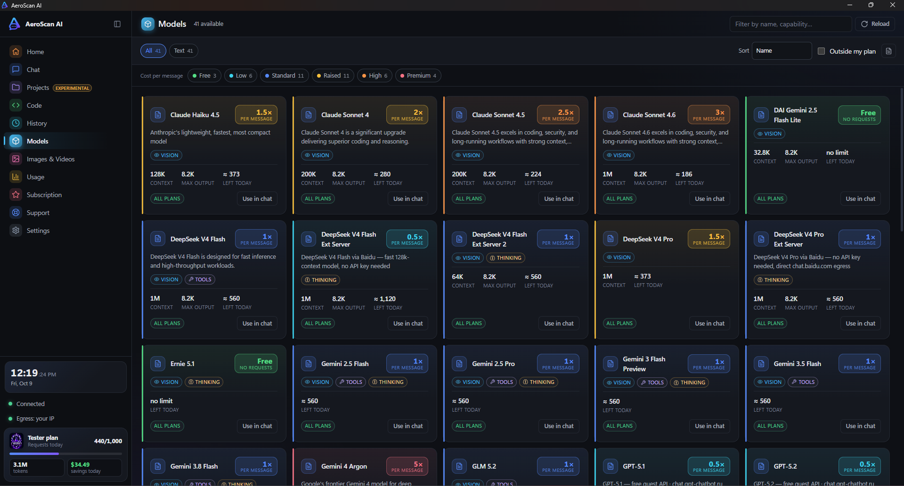</a><br><b>41 models, priced up front</b><br><sub>Filter by cost, vision, tools or thinking before you pick one.</sub></td>
<td width="33%" valign="top"><a href="docs/usage.png">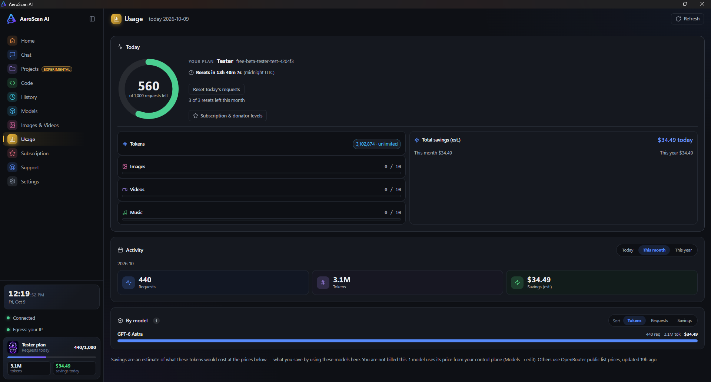</a><br><b>Always know what's left</b><br><sub>Requests left today, resets, and usage by model.</sub></td>
</tr>
<tr>
<td valign="top"><b>40+ models</b><br><sub>Switch models in a click. The cost is shown on every one.</sub></td>
<td valign="top"><b>Images and vision</b><br><sub>Generate images, or paste a screenshot and ask about it.</sub></td>
<td valign="top"><b>Your files stay local</b><br><sub>The agent works in folders you choose, on your PC.</sub></td>
</tr>
</table>

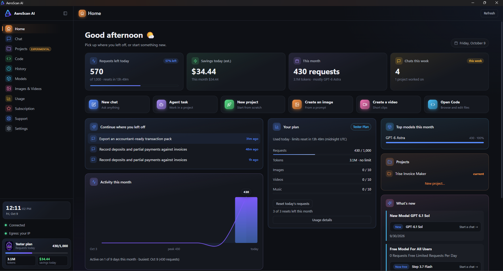

<br>

### CLOSED BETA
## The Tester plan, free for the first 20

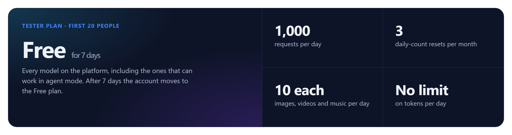

Register in the app while spots are open and you get full access for 7 days, then the account moves to the Free plan. When the 20 spots are gone, registration closes. The **[download page](https://ai.aeroscan.co.za/download)** shows how many are left, live.

<br>

### MODELS
## What each model costs

A chat message uses the number of requests shown. In agent mode, every step uses that many, so a 10-step task on a 3-request model uses 30. Free models never use a request.

<details>
<summary><b>Chat models (41)</b>: sorted by cost</summary>

| Model | Requests per message | Vision | Agent mode |
|---|---:|:---:|:---:|
| DAI Gemini 2.5 Flash Lite | Free | Yes | - |
| Ernie 5.1 | Free | Yes | - |
| MiniMax M2.5 | Free | Yes | - |
| DeepSeek V4 Flash Ext Server | 0.5 | - | - |
| GPT-5.1 | 0.5 | Yes | - |
| GPT-5.2 | 0.5 | Yes | - |
| GPT-5.4 Mini | 0.5 | Yes | - |
| GPT-5.4 Nano | 0.5 | Yes | - |
| GPT-5.4-Mini | 0.5 | Yes | - |
| DeepSeek V4 Flash | 1 | Yes | Yes |
| DeepSeek V4 Flash Ext Server 2 | 1 | Yes | - |
| DeepSeek V4 Pro Ext Server | 1 | - | - |
| Gemini 2.5 Flash | 1 | Yes | Yes |
| Gemini 2.5 Pro | 1 | Yes | Yes |
| Gemini 3 Flash Preview | 1 | Yes | Yes |
| Gemini 3.5 Flash | 1 | Yes | Yes |
| Gemini 3.8 Flash | 1 | Yes | Yes |
| GLM 5.2 | 1 | Yes | Yes |
| Mercury 2.5 Preview | 1 | Yes | - |
| Muse Spark 1.2 | 1 | Yes | - |
| Grok 4.20 | 1.2 | Yes | - |
| Grok 4.3 | 1.3 | Yes | - |
| Claude Haiku 4.5 | 1.5 | Yes | - |
| DeepSeek V4 Pro | 1.5 | Yes | - |
| Grok Build 0.1 | 1.5 | Yes | - |
| Qwen 3.7 Plus | 1.5 | Yes | Yes |
| Qwen 3.8 Omni Flash | 1.7 | Yes | Yes |
| Claude Sonnet 4 | 2 | Yes | - |
| GPT-5.6 Luna V1 | 2 | Yes | Yes |
| MiniMax M3 | 2 | Yes | - |
| Qwen 3.8 Max | 2 | Yes | Yes |
| Claude Sonnet 4.5 | 2.5 | Yes | - |
| GPT-6 Luna | 2.5 | Yes | Yes |
| Kimi K3 | 2.5 | Yes | - |
| Claude Sonnet 4.6 | 3 | Yes | - |
| GPT-5.6 Sol | 3 | Yes | Yes |
| GPT-5.6 Terra V1 | 3 | Yes | Yes |
| GPT-6 Sol | 3.5 | Yes | Yes |
| GPT-6.1 Sol | 4 | Yes | Yes |
| Gemini 4 Argon | 5 | Yes | - |
| GPT-6 Astra | 5 | Yes | Yes |

</details>

<details>
<summary><b>Agent mode models (17)</b>: can read, edit and run in your project</summary>

| Model | Requests per step | Vision |
|---|---:|:---:|
| DeepSeek V4 Flash | 1 | Yes |
| Gemini 2.5 Flash | 1 | Yes |
| Gemini 2.5 Pro | 1 | Yes |
| Gemini 3 Flash Preview | 1 | Yes |
| Gemini 3.5 Flash | 1 | Yes |
| Gemini 3.8 Flash | 1 | Yes |
| GLM 5.2 | 1 | Yes |
| Qwen 3.7 Plus | 1.5 | Yes |
| Qwen 3.8 Omni Flash | 1.7 | Yes |
| GPT-5.6 Luna V1 | 2 | Yes |
| Qwen 3.8 Max | 2 | Yes |
| GPT-6 Luna | 2.5 | Yes |
| GPT-5.6 Sol | 3 | Yes |
| GPT-5.6 Terra V1 | 3 | Yes |
| GPT-6 Sol | 3.5 | Yes |
| GPT-6.1 Sol | 4 | Yes |
| GPT-6 Astra | 5 | Yes |

</details>

<br>

### VERIFY
## Check your download

The beta isn't code-signed yet, which is why Windows shows a warning. To make sure the file is exactly ours, compare its SHA-256 hash with the one in the [release notes](https://github.com/adminaeroscan/aeroscan-beta/releases/latest):

```powershell
Get-FileHash "$env:USERPROFILE\Downloads\AeroScan.AI-Beta-Setup-1.0.0-beta.2-x64.exe" -Algorithm SHA256
```

<br>

### FAQ
## Questions

<details><summary><b>Is it free?</b></summary><br>Yes. The first 20 people to register get the Tester plan free for 7 days, then their account moves to the Free plan. Paid plans come later.</details>
<details><summary><b>Why does Windows say it "protected your PC"?</b></summary><br>The beta isn't code-signed yet, and SmartScreen warns about new unsigned apps. Click <b>More info</b>, then <b>Run anyway</b>. To be sure, check the file's hash as shown above.</details>
<details><summary><b>What counts as a request?</b></summary><br>Each chat message uses the request cost of the model you picked; free models use none. In agent mode, every step the agent takes uses the model's cost.</details>
<details><summary><b>Where do my files go?</b></summary><br>The agent only works in the project folder you choose, on your own PC. You review its changes and can undo them.</details>
<details><summary><b>Is the source code available?</b></summary><br>Not at the moment. This repository holds release builds only.</details>
<details><summary><b>Mac or Linux?</b></summary><br>Windows 10 and 11 (64-bit) only for now.</details>

<br>

<div align="center">

## Try it while the spots last

<a href="https://github.com/adminaeroscan/aeroscan-beta/releases/download/v1.0.0-beta.2/AeroScan.AI-Beta-Setup-1.0.0-beta.2-x64.exe"></a>

Found a bug or have an idea? **[Open an issue](https://github.com/adminaeroscan/aeroscan-beta/issues/new)**: say what you did, what you expected and what happened. A screenshot helps.

<sub>AeroScan AI · <a href="https://ai.aeroscan.co.za/download">ai.aeroscan.co.za</a></sub>

</div>
