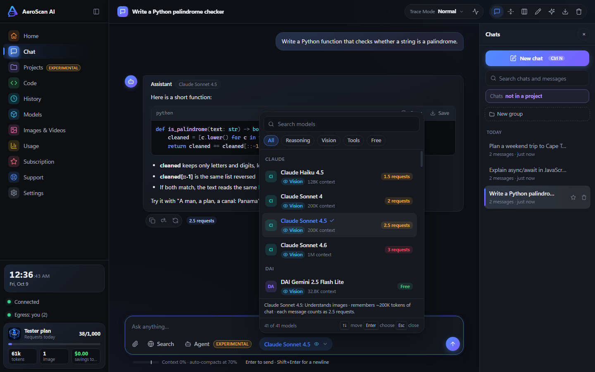
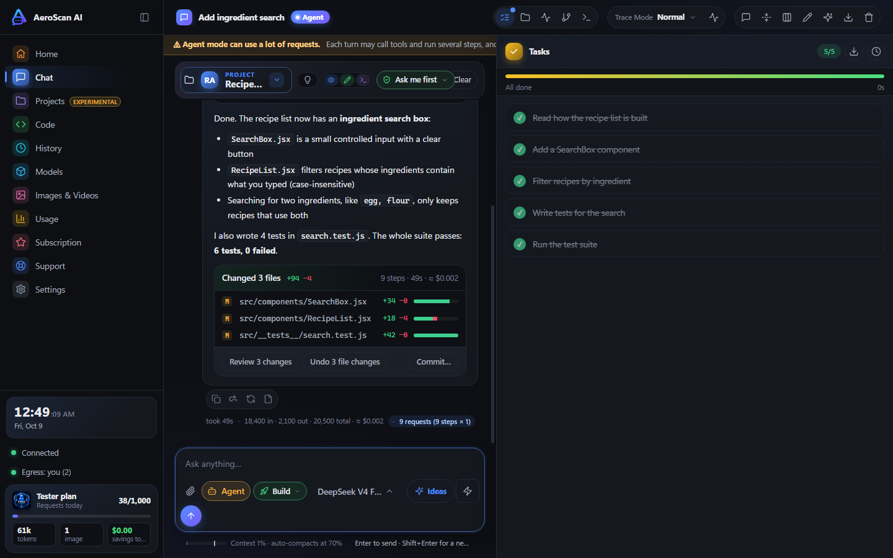
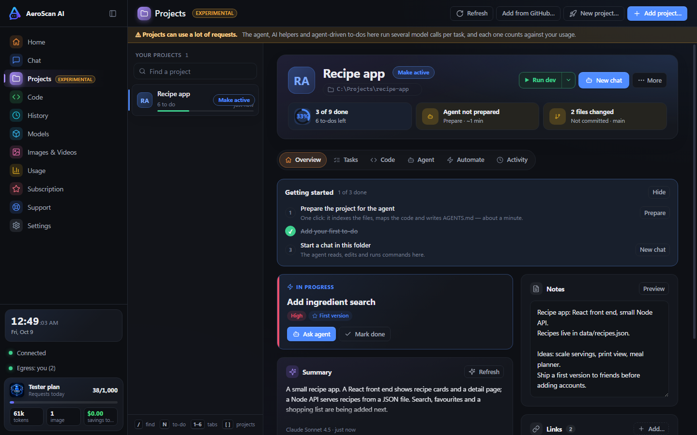

<div align="center">

# AeroScan AI

**A Windows desktop app for working with AI: chat, an agent that works in your projects, and image generation, all in one place.**

[](https://github.com/adminaeroscan/aeroscan-beta/releases/latest)
[](https://github.com/adminaeroscan/aeroscan-beta/releases)


### [⬇ Download the beta](https://github.com/adminaeroscan/aeroscan-beta/releases/latest) &nbsp;·&nbsp; [Website download page](https://ai.aeroscan.co.za/download)

</div>

---

<div align="center">



<sub>Every model shows what one message costs before you send it.</sub>



<sub>Agent mode works inside your project folder: it plans tasks, edits files, runs your tests, and lets you review or undo every change.</sub>



<sub>Projects keep to-dos, milestones, notes, chats and the agent together.</sub>

<sub><i>Screenshots use sample chat and project content. The model list and request costs are the real beta catalog.</i></sub>

</div>

---

## 🧪 Closed beta: first 20 testers get free access

We are looking for **20 testers**. The first 20 people to register in the app get the **Tester plan** for free:

| Tester plan | |
|---|---|
| Requests per day | **1,000** |
| Resets of the daily count | **3 per month** |
| Images / videos / music per day | 10 each |
| Daily token limit | none |
| Models | every model on the platform |

Tester access is valid for 7 days from when your key is created, then the account returns to the Free plan. When the 20 spots are gone, registration closes. The [download page](https://ai.aeroscan.co.za/download) shows how many are left.

## What you get

- **Chat** with many AI models from one app. Each model shows its request cost next to its name, so you know what a message will use before you send it.
- **Agent mode** that works inside your own project folders: it reads, edits and builds. It uses one request per step, so watch the cost of big builds.
- **Projects** page to keep a project's chats, notes, code and agent work together.
- **Image generation** from the same window.

## Models

The costs below are what a Tester account is charged. Free means the model never uses a request.

### Chat models (41)

Pick any of these in a normal chat. A message costs the number shown.

| Model | Requests per message | Vision | Agent mode |
|---|---:|:---:|:---:|
| DAI Gemini 2.5 Flash Lite | Free | Yes | - |
| Ernie 5.1 | Free | Yes | - |
| MiniMax M2.5 | Free | Yes | - |
| DeepSeek V4 Flash Ext Server | 0.5 | - | - |
| GPT-5.1 | 0.5 | Yes | - |
| GPT-5.2 | 0.5 | Yes | - |
| GPT-5.4 Mini | 0.5 | Yes | - |
| GPT-5.4 Nano | 0.5 | Yes | - |
| GPT-5.4-Mini | 0.5 | Yes | - |
| DeepSeek V4 Flash | 1 | Yes | Yes |
| DeepSeek V4 Flash Ext Server 2 | 1 | Yes | - |
| DeepSeek V4 Pro Ext Server | 1 | - | - |
| Gemini 2.5 Flash | 1 | Yes | Yes |
| Gemini 2.5 Pro | 1 | Yes | Yes |
| Gemini 3 Flash Preview | 1 | Yes | Yes |
| Gemini 3.5 Flash | 1 | Yes | Yes |
| Gemini 3.8 Flash | 1 | Yes | Yes |
| GLM 5.2 | 1 | Yes | Yes |
| Mercury 2.5 Preview | 1 | Yes | - |
| Muse Spark 1.2 | 1 | Yes | - |
| Grok 4.20 | 1.2 | Yes | - |
| Grok 4.3 | 1.3 | Yes | - |
| Claude Haiku 4.5 | 1.5 | Yes | - |
| DeepSeek V4 Pro | 1.5 | Yes | - |
| Grok Build 0.1 | 1.5 | Yes | - |
| Qwen 3.7 Plus | 1.5 | Yes | Yes |
| Qwen 3.8 Omni Flash | 1.7 | Yes | Yes |
| Claude Sonnet 4 | 2 | Yes | - |
| GPT-5.6 Luna V1 | 2 | Yes | Yes |
| MiniMax M3 | 2 | Yes | - |
| Qwen 3.8 Max | 2 | Yes | Yes |
| Claude Sonnet 4.5 | 2.5 | Yes | - |
| GPT-6 Luna | 2.5 | Yes | Yes |
| Kimi K3 | 2.5 | Yes | - |
| Claude Sonnet 4.6 | 3 | Yes | - |
| GPT-5.6 Sol | 3 | Yes | Yes |
| GPT-5.6 Terra V1 | 3 | Yes | Yes |
| GPT-6 Sol | 3.5 | Yes | Yes |
| GPT-6.1 Sol | 4 | Yes | Yes |
| Gemini 4 Argon | 5 | Yes | - |
| GPT-6 Astra | 5 | Yes | Yes |

### Agent mode models (17)

These can read and edit files in your project folder. Agent mode uses **one request per step** at the model's cost, so a 10-step task on a 3-request model uses 30 requests.

| Model | Requests per step | Vision |
|---|---:|:---:|
| DeepSeek V4 Flash | 1 | Yes |
| Gemini 2.5 Flash | 1 | Yes |
| Gemini 2.5 Pro | 1 | Yes |
| Gemini 3 Flash Preview | 1 | Yes |
| Gemini 3.5 Flash | 1 | Yes |
| Gemini 3.8 Flash | 1 | Yes |
| GLM 5.2 | 1 | Yes |
| Qwen 3.7 Plus | 1.5 | Yes |
| Qwen 3.8 Omni Flash | 1.7 | Yes |
| GPT-5.6 Luna V1 | 2 | Yes |
| Qwen 3.8 Max | 2 | Yes |
| GPT-6 Luna | 2.5 | Yes |
| GPT-5.6 Sol | 3 | Yes |
| GPT-5.6 Terra V1 | 3 | Yes |
| GPT-6 Sol | 3.5 | Yes |
| GPT-6.1 Sol | 4 | Yes |
| GPT-6 Astra | 5 | Yes |

## Install

1. Download **`AeroScan AI-Beta-Setup-…-x64.exe`** from the [latest release](https://github.com/adminaeroscan/aeroscan-beta/releases/latest). Prefer no install? Take the **Portable** file instead.
2. Run it. Windows SmartScreen will warn you because the beta is **not code-signed yet**: click **More info**, then **Run anyway**.
3. Open AeroScan AI and register with your email. You'll get your tester key automatically.

Requires Windows 10 or 11, 64-bit.

### Verify your download

Every release lists the SHA-256 hash of each file in its notes. In PowerShell:

```powershell
Get-FileHash "AeroScan AI-Beta-Setup-1.0.0-beta.2-x64.exe" -Algorithm SHA256
```

The result must match the hash in the [release notes](https://github.com/adminaeroscan/aeroscan-beta/releases/latest).

## Feedback wanted

This is a beta, so expect rough edges. The most useful reports cover:

- the first-run setup,
- agent mode,
- the projects page.

👉 **[Open an issue](https://github.com/adminaeroscan/aeroscan-beta/issues/new)** with what you did, what you expected, and what happened. A screenshot helps.

## FAQ

**Is it free?** Yes during the beta, for the first 20 registrants. Paid plans are planned for later.

**Is the source code available?** Not at the moment. This repository holds release builds only.

**Why the SmartScreen warning?** Signing certificates cost money and the beta is new. Use the hash check above if you want to confirm the file.

**Mac or Linux?** Windows only for now.

---

<div align="center">AeroScan AI · <a href="https://ai.aeroscan.co.za/download">ai.aeroscan.co.za</a></div>
